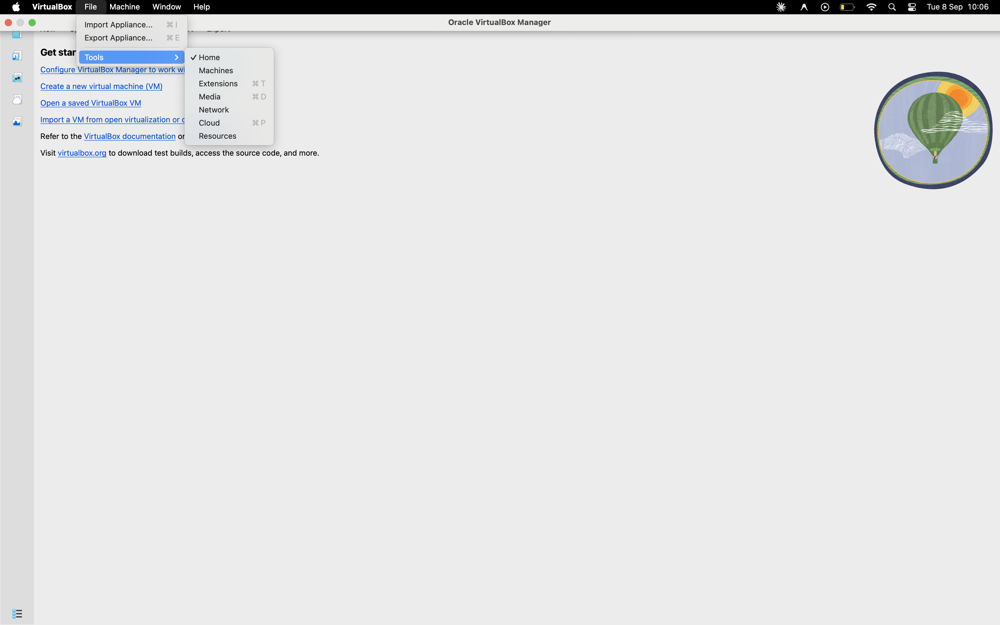
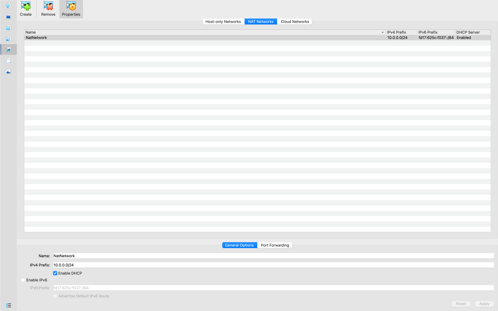
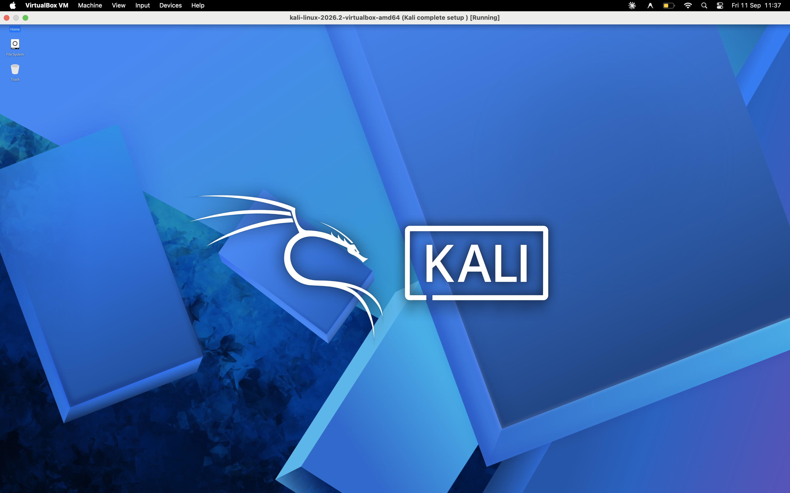
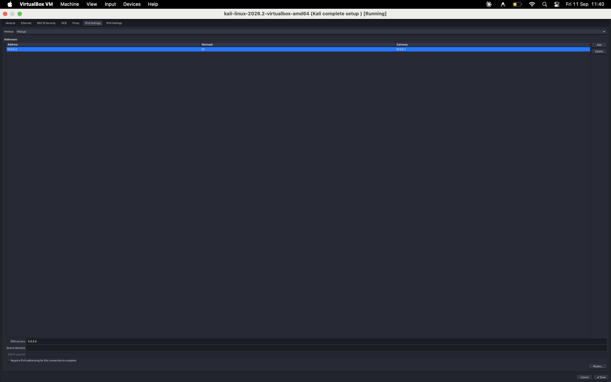

<div align="center">

# 🔐 NETWORKWALKS-B083-WK1-PM1-CYBERSECURITY-LAB-SETUP

**A controlled VirtualBox and Kali Linux environment for cybersecurity learning**

</div>

<p align="center">
  
  
  
  
</p>

---

## 📌 Project Overview

This B083 project documents the setup of a small, repeatable cybersecurity laboratory using VirtualBox and Kali Linux. The lab uses a dedicated NAT Network so that future attacker and target virtual machines can communicate on a private address range while retaining outbound connectivity through NAT.

The repository is a setup record and learning reference. The included screenshots document the VirtualBox and Kali configuration; commands below provide a procedure for repeating or checking the configuration.

## 🎯 Objectives

- Install and configure VirtualBox as the lab hypervisor.
- Import Kali Linux as the security-testing virtual machine.
- Create a dedicated `NatNetwork` NAT Network.
- Configure and verify IPv4 addressing, gateway, and DNS settings.
- Capture a clean VM snapshot before experimental work.
- Leave a documented network range for future lab machines.

## 🛡️ Ethical Use Warning

Use this laboratory only for education and for systems that you own or have explicit permission to test. Do not use Kali Linux, scanning tools, or this network configuration to attack, scan, or access unauthorized systems. Keep target machines inside the isolated lab network unless a separate, authorized design requires otherwise.

## 🏗️ Lab Architecture

The host runs VirtualBox, which connects Kali Linux and future lab VMs to the same NAT Network.

```text
MacBook Pro (macOS host)
└── VirtualBox 7.2
    └── NatNetwork (10.0.0.0/24)
        ├── Kali Linux (10.0.0.2/24)
        └── Future authorized lab VMs (10.0.0.3–10.0.0.99)
```



## ⚙️ Lab Configuration

| Component | Configuration |
| --- | --- |
| Host OS | macOS |
| Host device | MacBook Pro |
| Host RAM | 3 GB |
| Processor | Intel Core i9 |
| Hypervisor | VirtualBox 7.2 |
| Security OS | Kali Linux 2026.2 |
| Kali RAM | 2048 MB |
| Virtual network | NAT Network |
| Network name | `NatNetwork` |
| Network address | `10.0.0.0/24` |
| Kali IP address | `10.0.0.2/24` |
| Default gateway | `10.0.0.1` |
| DNS server | `8.8.8.8` |
| Future VM range | `10.0.0.3–10.0.0.99` |

> The host values above are personalized for the B083 workstation. The remaining values follow the documented lab design and should be checked against the local VirtualBox and Kali screens before use.

## 🪜 Setup Procedure

### 1. Prepare the VM archive

If the Kali package is supplied as a `.7z` archive, install an archive utility such as [7-Zip](https://7-zip.org/download.html) and extract it to a location with sufficient free space.

### 2. Install VirtualBox

Install [VirtualBox 7.2](https://virtualbox.org/wiki/Downloads) for macOS, then open VirtualBox and confirm that the application can create or import virtual machines.

### 3. Create the NAT Network

In **VirtualBox → Tools → Network → NAT Networks**, create or edit the network with these values:

```text
Network name: NatNetwork
IPv4 prefix:  10.0.0.0/24
DHCP:         Enabled
IPv6:         Disabled
```



A NAT Network is used instead of a VM-only standard NAT adapter because multiple VMs on the same NAT Network can communicate with one another while receiving outbound NAT connectivity.

### 4. Import and configure Kali Linux

Download Kali only from the [official Kali Linux site](https://www.kali.org/get-kali/), then import the VM into VirtualBox. Configure the VM as follows:

```text
Adapter 1
Attached to: NAT Network
Network:     NatNetwork
Adapter type: Intel PRO/1000 MT Desktop
Memory:      2048 MB
```



### 5. Configure Kali networking

Check the active connection name before making changes. Configure the Kali VM with the lab values:

```text
IPv4 address: 10.0.0.2
Subnet mask:  255.255.255.0
Gateway:      10.0.0.1
DNS:          8.8.8.8
```



### 6. Create a clean snapshot

After the initial configuration is stable, create a VirtualBox snapshot such as:

```text
Clean Kali - Network Setup
```

Use this baseline to recover the VM after authorized experiments change its state.

## 🔎 Verification Checklist

Run these checks inside Kali after the VM is started. The expected values are based on the configuration table; record the actual output when completing the lab.

| Check | Command | Expected result |
| --- | --- | --- |
| IP address | `ip a` | `10.0.0.2/24` is shown on the active interface |
| Gateway reachability | `ping -c 4 10.0.0.1` | Replies from the gateway |
| Internet reachability | `ping -c 4 8.8.8.8` | Replies from the DNS server |
| DNS resolution | `nslookup networkwalks.com` | The domain resolves |
| Nmap availability | `nmap --version` | A version is displayed |
| Snapshot recovery | Restore the clean snapshot, then run `ip a` | Baseline configuration returns |

These are verification commands, not claims that every check has been run in this repository.

## 🐞 Problems and Solutions

### Edit Connection option not visible on macOS

On macOS, the **Edit Connection** option was not visible in the available network interface. The connection was accessed and configured with NetworkManager's graphical editor instead:

```bash
nm-connection-editor
```

If the editor is not available from the application menu, launch it from a terminal. The exact editor and available controls can vary by Kali desktop environment and installation.

### VirtualBox Network settings difficult to find

In VirtualBox, the **Network** section was difficult to find while the settings interface was using **Basic** view. Switching the interface from **Basic** to **Expert** exposed the Network options and made the adapter configuration accessible.

### Virtualization or VT-x startup error

If the VM cannot start because hardware virtualization is unavailable, check that Intel VT-x or the platform's hardware-virtualization setting is enabled in firmware/UEFI. Save the setting, restart the host, and try the VM again. On macOS, also confirm that the host and VirtualBox versions support the selected guest configuration.

## 💡 Learning Summary

- **NAT vs. NAT Network:** A NAT Network permits communication between attached VMs while providing NAT access beyond the virtual network.
- **Virtual machine networking:** Adapter mode, network name, and IP settings determine how lab machines communicate.
- **Static IPv4 configuration:** A documented address, subnet, gateway, and DNS value make repeatable exercises easier to troubleshoot.
- **Snapshots:** A clean snapshot provides a known-good recovery point before risky or experimental work.
- **Documentation:** Screenshots, commands, and explicit assumptions make a lab easier to reproduce and audit.

## 🔗 Resources

- [VirtualBox downloads](https://virtualbox.org/wiki/Downloads)
- [Kali Linux downloads](https://www.kali.org/get-kali/)
- [7-Zip downloads](https://7-zip.org/download.html)
- [VirtualBox networking documentation](https://www.virtualbox.org/manual/ch06.html)
- [Kali Linux documentation](https://www.kali.org/docs/)

## 👤 Author and Project Information

**Author:** B083 Cybersecurity Lab Participant

**Program:** Cybersecurity at NetworkWalks

**Week:** 01

**Project:** Cybersecurity and penetration-testing lab setup

**Repository:** `houssen10/NETWORKWALKS-B083-WK1-PM1-CYBERSECURITY-LAB-SETUP`

This documentation is intended for the B083 learning project and should be adapted when the host hardware, hypervisor version, or lab network changes.
